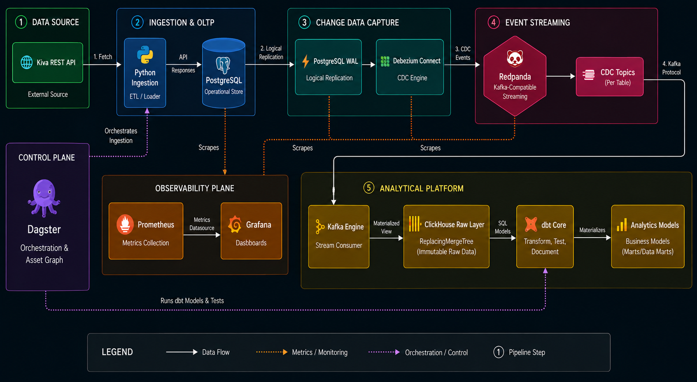

# Inkomoko Data Platform - Senior Data Engineer Assessment

## Architecture Overview
This repository contains a production-grade, end-to-end data analytics platform designed for the Inkomoko Senior Data Engineer assessment. 

The architecture simulates a modern, resilient, and highly scalable data stack capable of handling real-time streaming and massive analytical workloads, while being extremely conscious of hardware resource limitations.

### The Stack:
1. **Ingestion (Source):** Python REST API Ingestion into **PostgreSQL** (OLTP).
2. **Change Data Capture (CDC):** **Debezium** tracking logical replication slots in Postgres.
3. **Event Stream:** **Redpanda** (A lightweight, C++ Kafka alternative requiring zero JVM overhead).
4. **Data Warehouse (OLAP):** **ClickHouse**, utilizing native Kafka-engine ingestion to sink messages instantly without a dedicated connector service.
5. **Transformation & Data Quality:** **dbt (Data Build Tool)** executing SQL transformations and data quality tests directly inside ClickHouse.
6. **Orchestration:** **Dagster** orchestrating the entire lineage from API fetch -> CDC Buffer -> dbt Run -> dbt Test.
7. **Observability:** **Prometheus & Grafana** natively scraping Redpanda and ClickHouse health metrics.

### Architecture Flow


---

## Design Decisions

* **Redpanda over Kafka:** Kafka requires Zookeeper (or KRaft) and a massive JVM memory footprint. Redpanda is a C++ Kafka-compatible binary that runs in a fraction of the memory, avoiding local machine crashes during testing.
* **ClickHouse over Postgres for Analytics:** Postgres is excellent for OLTP, but ClickHouse is a columnar analytical engine capable of processing billions of rows per second. By separating OLTP and OLAP, the architecture guarantees production stability.
* **ClickHouse `FINAL` modifier for CDC:** Instead of complex SQL deduplication logic, the dbt staging model leverages ClickHouse's `ReplacingMergeTree` and `FINAL` modifier to instantly collapse CDC event history into the absolute latest state.
* **Dagster over Airflow (For Local Assessment):** Airflow relies on a webserver, scheduler, and worker (often requiring multiple gigabytes of RAM). I moved to Dagster solely to run this project efficiently on limited local hardware. However, for an enterprise-grade orchestrator in a production environment, I would definitely go with **Apache Airflow**.
* **Docker Compose Healthchecks & Network Isolation:** Every container implements strict health checks and startup sequencing, mitigating race conditions during localized deployment.

## Future Scalability
If deploying this to an Enterprise Cloud environment (e.g., GCP or AWS) at massive scale, the architecture would evolve to ensure maximum resilience and throughput:
1. **Enterprise Orchestration with Airflow:** While Dagster was used locally to bypass hardware constraints, I would absolutely migrate to **Apache Airflow** for the enterprise-grade orchestrator. Its distributed executors and massive community ecosystem make it the undisputed choice for scaling production pipelines.
2. **Replacing Redpanda with Apache Kafka:** Redpanda was utilized for this local assessment to bypass JVM constraints, but considering the overload and stability requirements of a true production environment, I will use **Apache Kafka** in place of Redpanda. Kafka remains the battle-tested, enterprise standard for streaming data at immense scale.
3. **dbt Fusion (Rust Engine):** Upgrading the transformation layer from the legacy Python-based `dbt-core` to the new Rust-based **dbt Fusion** execution engine. This would massively reduce DAG compilation times and memory overhead for projects with thousands of models.

---

## Dataset & Domain Overview
This platform ingests and processes live micro-finance loan data fetched directly from the **Kiva Public REST API** (`https://api.kivaws.org/v1/loans/search.json`). 

### Why Kiva Data?
Kiva is a global micro-lending platform that provides loan capital to entrepreneurs and small business owners in developing regions. This domain was deliberately chosen because it directly mirrors **Inkomoko's core mission** of empowering refugee entrepreneurs and micro-businesses across East Africa with financial access, business training, and loan capital.

### Schema & Core Attributes:
The pipeline ingests real-time transactional loan records with the following schema:
* `id` (BigInt): Unique loan identifier (Primary Key for CDC deduplication).
* `name` (String): Name of the entrepreneur or borrowing group.
* `status` (String): Current loan funding state (e.g., `funded`).
* `funded_amount` (Float64/Decimal): Capital raised for the loan.
* `loan_amount` (Float64/Decimal): Total capital requested by the entrepreneur.
* `activity` (String): Specific micro-business activity (e.g., *Farming*, *Retail*, *Tailoring*).
* `sector` (String): Industry sector (e.g., *Agriculture*, *Services*, *Food*).
* `country` & `town` (String): Geographical region of the borrower.
* `posted_date` (Timestamp): Timestamp when the loan was published on the platform.

---

## How to Run Locally

### Prerequisites
* Docker & Docker Compose
* Git

### 1. Spin up the Infrastructure
```bash
docker compose up -d
```
*This starts Postgres, Redpanda, Debezium, ClickHouse, Dagster, Prometheus, and Grafana.*

### 2. Register the Debezium CDC Connector
Debezium needs to be told which tables to monitor.
```bash
curl -i -X POST -H "Accept:application/json" -H "Content-Type:application/json" http://localhost:8083/connectors/ -d "@config/debezium_postgres_source.json"
```

### 3. Run the Orchestration Pipeline (Dagster)
Open your browser and navigate to **[http://localhost:3000](http://localhost:3000)**.
1. Click on **Assets** in the top navigation bar.
2. Click **Materialize All** to run the full pipeline.

**What happens under the hood?**
1. Dagster executes the Python script to fetch real Kiva Loan data and upserts it into Postgres.
2. Debezium captures the inserts/updates and streams them as JSON into Redpanda.
3. ClickHouse consumes the Redpanda stream instantly into `raw_data.kiva_loans_raw`.
4. Dagster runs `dbt run` to materialize the models in ClickHouse.
5. Dagster runs `dbt test` to enforce data quality constraints (Unique IDs, Non-Null values, Accepted Statuses).

---

## 📈 Observability & Business Dashboards
* **Dagster UI:** http://localhost:3000
* **Grafana Dashboards:** http://localhost:3001 (Credentials: `admin` / `inkomoko`)
  - **Inkomoko Pipeline Observability:** Real-time operational metrics (Redpanda throughput, ClickHouse memory, queries, & write ops).
  - **Inkomoko Executive Loan Analytics:** Business Intelligence & ML feature distributions querying ClickHouse data marts directly (`analytics.int_loans_enriched` & `analytics.mart_loan_features_ml`).
* **Prometheus Targets:** http://localhost:9090
