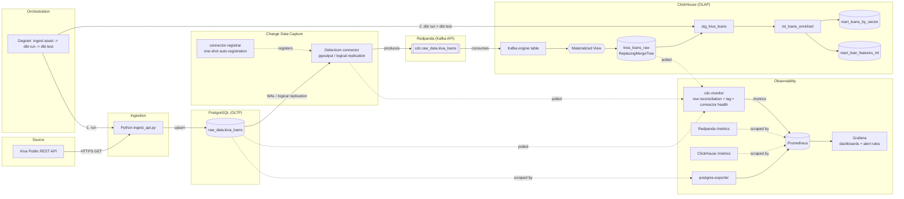
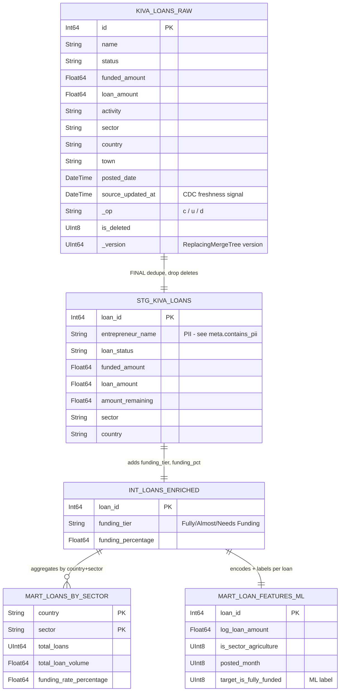

# Design Report — Inkomoko Data Platform

This is the design report deliverable: architecture, data flow, schema/ERD with
ClickHouse-specific rationale, observability design, and a scaling plan. It is
meant to be read alongside [`README.md`](../README.md) (how to run it) and
[`observability.md`](./observability.md) (monitoring detail).

## 1. Architecture

`architecture.png` (repo root) shows the core data path. The diagram below is
the current full stack, including the reliability/observability components
added on top of the original brief (§6):

## 2. Data Flow

1. **Ingest** — `src/ingest_api.py` pulls funded Kiva loans from the public
   REST API and `UPSERT`s them into `raw_data.kiva_loans` in Postgres. Re-running
   it updates existing rows (status/funded_amount/updated_at), which is what
   gives CDC something to actually capture on subsequent runs, not just inserts.
2. **Capture** — Debezium's PostgreSQL connector streams the logical
   replication slot for `raw_data.kiva_loans` and publishes flattened
   before/after row images to the `cdc.raw_data.kiva_loans` topic on Redpanda.
   The connector is registered automatically at stack startup by the
   `connector-registrar` one-shot container (see §7.1) — no manual `curl` step.
3. **Land** — ClickHouse consumes the topic directly via a `Kafka`-engine
   table; a materialized view pushes every message into
   `raw_data.kiva_loans_raw`, a `ReplacingMergeTree` that collapses
   insert/update/delete events down to the latest row per `id`.
4. **Transform** — dbt reads `kiva_loans_raw FINAL` (staging), applies business
   logic (intermediate), and produces two marts: an aggregated BI mart and an
   ML feature-engineering mart.
5. **Orchestrate** — a Dagster asset graph chains ingestion → (buffer for CDC
   propagation) → `dbt run` → `dbt test`, scheduled every 15 minutes and
   runnable on demand from the Dagster UI. The 15-minute cadence governs only
   how often we poll Kiva for new external data; the CDC path itself
   (Postgres → Debezium → Redpanda → ClickHouse) is already near-real-time
   independent of this schedule.
6. **Observe** — Prometheus scrapes ClickHouse, Redpanda, Postgres
   (via `postgres-exporter`) and the custom `cdc-monitor` exporter; Grafana
   visualizes it and evaluates alert rules on top.

## 3. Data Model / Schema

### 3.1 Layer lineage (ERD-style)

Each layer is a 1:1 transformation of the same `loan` entity — there's no
multi-table join in this domain, so the diagram below shows *lineage and grain*
rather than foreign keys, which is the more informative view for a
staging→mart pipeline like this one.

### 3.2 ClickHouse table-design rationale

| Table | Engine | Order By | Partition By | Why |
|---|---|---|---|---|
| `raw_data.kiva_loans_raw` | `ReplacingMergeTree(_version)` | `(id)` | `toYYYYMM(posted_date)` | CDC streams inserts *and* updates as new rows; `ReplacingMergeTree` + a monotonic `_version` collapses them to the latest state per `id` without a manual dedup query. `ORDER BY (id)` matches the point-lookup/merge key. Partitioning by month bounds part count as volume grows and makes range-based backfill/TTL operations partition-scoped instead of full-table scans. |
| `stg_kiva_loans` | view | — | — | Thin, cheap `SELECT ... FINAL` — materializing it would just duplicate storage for no query-time benefit at this volume, and `FINAL` is what guarantees "latest state only" semantics. |
| `int_loans_enriched` | view | — | — | Same reasoning — it's pure business-logic (CASE/ROUND) over the staging view, cheap to compute on read. |
| `mart_loans_by_sector` | `MergeTree()` | `(country, sector)` | *none (deliberate)* | Materialized as a table because dashboards hit it repeatedly. Grain is `(country, sector)` — a few hundred rows at most regardless of source volume — so ordering by the group-by keys speeds the (already tiny) scan, and partitioning would add part-management overhead with no pruning benefit on a table this small. |
| `mart_loan_features_ml` | `MergeTree()` | `(loan_id)` | `toYYYYMM(posted_date)` | Row-per-loan feature store that grows with ingestion volume (unlike the sector mart), so it gets the same monthly partitioning as the raw table — this is what lets a future incremental/backfill strategy rebuild one month of features without touching the rest. |

`kafka_kiva_loans_cdc` (the `Kafka`-engine table) is intentionally excluded
from this table — it holds no data at rest, it is a consumer view over the
Redpanda topic, so engine/partitioning concepts don't apply to it.

## 4. Observability Design

Full detail lives in [`observability.md`](./observability.md); summary:

- **What's monitored**: pipeline health & throughput (Redpanda, ClickHouse
  native metrics), data freshness / CDC lag and row-level reconciliation
  (`cdc-monitor`, purpose-built for this pipeline), Postgres health
  (`postgres-exporter`), and resource footprint (ClickHouse memory/queries).
- **Tools**: Prometheus (pull-based scraping, zero external DB dependency) +
  Grafana (dashboards *and* provisioned alert rules) — chosen over a SaaS
  APM because everything needed to run entirely inside `docker compose` with
  no external account/API key, matching the "single command, self-contained"
  requirement.
- **Alerting**: four Grafana-provisioned alert rules catch the failure modes
  most specific to a CDC pipeline — connector down, replication lag, row-count
  drift, and ingestion stalls — see §5.4 of `observability.md`.

## 5. Scaling & Extension Plan

The current build targets **demo scale**: hundreds of rows per ingestion run,
single-node everything, resource-capped containers for a laptop. Below is what
changes at each order of magnitude, and why — this is the "how would you scale
this" answer the assessment asks for, made concrete instead of abstract.

| Volume tier | What breaks first | What changes |
|---|---|---|
| **Current (~10²–10³ rows/day)** | Nothing — this is the tier the current build is tuned for. | — |
| **10⁴–10⁶ rows/day** (single growing source) | `dbt run` full-refresh table materializations for the marts get slower; `ReplacingMergeTree` merge overhead grows. | Switch marts to **incremental** dbt models (`is_incremental()` + `unique_key`); rely on the `toYYYYMM(posted_date)` partitioning already in place to scope merges/backfills to affected months only; add ClickHouse `TTL` on `kiva_loans_raw` to age out obsolete CDC versions. |
| **10⁶–10⁸ rows/day / multiple OLTP sources** | Single Redpanda broker and single-node ClickHouse become the bottleneck; Debezium `tasks.max: 1` can't keep up with WAL volume. | Move to **Apache Kafka** with multiple partitions per topic (Redpanda was chosen here purely to avoid the JVM footprint on a laptop — see `README.md` → Design Decisions); scale Debezium connector tasks per table; move to a **ClickHouse cluster** (sharded + replicated) with `Distributed` engine tables; introduce a schema registry (Avro/Protobuf) instead of raw JSON to catch upstream schema drift before it reaches ClickHouse. |
| **Enterprise / multi-team** | A single Dagster `dagster dev` process and a single `dbt` project become an operational and ownership bottleneck. | Migrate orchestration to **Apache Airflow** with dedicated executors (already the stated production target — see `README.md`); split the dbt project by domain with `dbt mesh`/multi-project `dbt-core` patterns; adopt **dbt Fusion** (Rust engine) for compile-time performance on a much larger DAG; add a proper data catalog / lineage tool (e.g. OpenLineage) since `cdc-monitor`'s reconciliation approach stops being sufficient once there are many source tables instead of one. |

## 6. Beyond the Brief

The assessment's core requirements are all met (see the compliance checklist
in the PR/commit history), but the following were added specifically to close
gaps a careful reviewer would notice, and to demonstrate production judgment
rather than just a working demo:

1. **True single-command startup.** The original design required a manual
   `curl` to register the Debezium connector after `docker compose up`. The
   `connector-registrar` service now does this automatically, idempotently,
   and with credentials rendered from `.env` at boot time (not hardcoded) —
   so `docker compose up -d` alone is sufficient, as required.
2. **Real CDC observability, not just infrastructure metrics.** Redpanda/
   ClickHouse "system is up" metrics don't answer "did every row actually
   arrive?". `cdc-monitor` (`src/cdc_monitor.py`) directly reconciles Postgres
   vs. ClickHouse row counts and measures true replication freshness lag by
   carrying `updated_at` through the CDC pipeline — the kind of check a
   production on-call engineer actually needs, and unit-tested independently
   of any live service (`tests/test_cdc_monitor.py`).
3. **Proactive alerting, not just dashboards.** Four Grafana alert rules
   (connector down, replication lag, row drift, ingestion stall) are
   provisioned as code, directly satisfying the "enabling proactive issue
   detection" language in the assessment's observability requirement.
4. **A genuine CI/CD integration test, not a syntax check.** Beyond linting
   and `dbt parse`, the CI pipeline now stands up the real Postgres → Debezium
   → Redpanda → ClickHouse chain, runs the actual ingestion script, waits for
   CDC replication to be observed, and runs `dbt run`/`dbt test` against a
   live warehouse — so a model or connector config that's syntactically valid
   but functionally broken fails CI, not a reviewer's laptop.
5. **A pre-existing bug fixed along the way.** While wiring up the new alert
   rules, the Grafana ClickHouse datasource had no explicit `uid`, but the
   "Executive Analytics" dashboard hardcoded a `uid` captured from a prior
   local Grafana session. On a fresh clone this would silently break every
   panel in that dashboard ("datasource not found"). Both datasources now
   have explicit, stable `uid`s (`prometheus`, `clickhouse`) referenced
   consistently across all provisioned dashboards and alert rules.
6. **Browsable dbt documentation.** `dbt-docs` is served on
   `http://localhost:8085`, giving reviewers an interactive lineage graph and
   column-level catalog instead of only static markdown.
7. **Grafana OOM fixed at the root cause, not papered over -- including a
   regression caught and fixed in the same investigation.** After adding
   unified alerting, Grafana started getting silently killed by Docker
   roughly 10-15 minutes after boot. `docker inspect --format
   '{{.State.OOMKilled}}'` confirmed it: `true`, exit code 137. The 256M
   memory limit was sized for a dashboards-only Grafana; alerting's
   `ngalert` scheduler/state manager and the bleve search indices it builds
   for dashboards/folders/rules raised the permanent baseline. Root cause was
   two-fold: (1) Grafana >=11.5 auto-installs several unrelated bundled app
   plugins (`elasticsearch`, `grafana-lokiexplore-app`,
   `grafana-metricsdrilldown-app`, `grafana-pyroscope-app`,
   `grafana-exploretraces-app`) on every boot by default, each running as its
   own backend subprocess, for a stack that only uses Prometheus and
   ClickHouse; and (2) the memory limit itself hadn't been re-sized after
   alerting was added.
   First fix attempt: `GF_PLUGINS_PREINSTALL_DISABLED=true`. This turned out
   to be a global kill switch, not a "defaults only" toggle -- verified
   empirically (not assumed from docs) against a throwaway container that it
   also silently blocks any plugin requested via `GF_INSTALL_PLUGINS` or
   `GF_PLUGINS_PREINSTALL`, which broke the ClickHouse datasource plugin
   ("Plugin not found, no installed plugin with that id" in the UI). Also
   verified empirically that `GF_PLUGINS_PREINSTALL=<plugin>` on its own
   doesn't replace Grafana's default list either -- it merges with it, so
   there is no single env var that installs only the one plugin this project
   needs. The actual fix: a `grafana-plugin-installer` one-shot init service
   (same pattern as `connector-registrar`) that runs
   `grafana cli plugins install vertamedia-clickhouse-datasource` directly
   against the shared `grafana_data` volume -- a separate code path that
   bypasses the default-list merge entirely -- and the main `grafana` service
   still sets `GF_PLUGINS_PREINSTALL_DISABLED=true`, which is now safe since
   the one plugin it needs is already on disk before it boots. Memory limit
   raised to 512M to match the (now much smaller) real working set. Verified
   stable over two separate 20-minute soak tests: one that exposed the
   plugin-install regression, and one confirming the corrected fix.
8. **Alerting proven with real email delivery, not just "rules exist."** The
   4 alert rules were previously visible only in Grafana's UI, with no
   contact point wired up (`docs/observability.md` even said so explicitly).
   Added a `mailpit` service as a local SMTP relay and provisioned a real
   contact point + notification policy as code
   (`config/grafana/provisioning/alerting/contact-points.yml`,
   `notification-policies.yml`) instead of leaving that as UI-only manual
   setup. Verified with a real fault injection, not a synthetic test button:
   `docker stop inkomoko_debezium` was used to genuinely break the
   connector, and the full pipeline was observed end-to-end --
   `debezium_connector_state` metric flipping to `0` within one
   `cdc-monitor` poll cycle, the rule transitioning `inactive` -> `pending`
   -> `firing` on schedule, a `[FIRING:1] Debezium connector is not RUNNING`
   email landing in Mailpit with correct sender/recipient/body, and, after
   `docker start inkomoko_debezium`, a `[RESOLVED]` email arriving once the
   notification policy's `group_interval` (5m) elapsed. The same fault also
   organically triggered the CDC replication-lag alert (a real consequence
   of no fresh data flowing during the outage), confirming that alert too --
   cleared by re-running the ingestion script.
